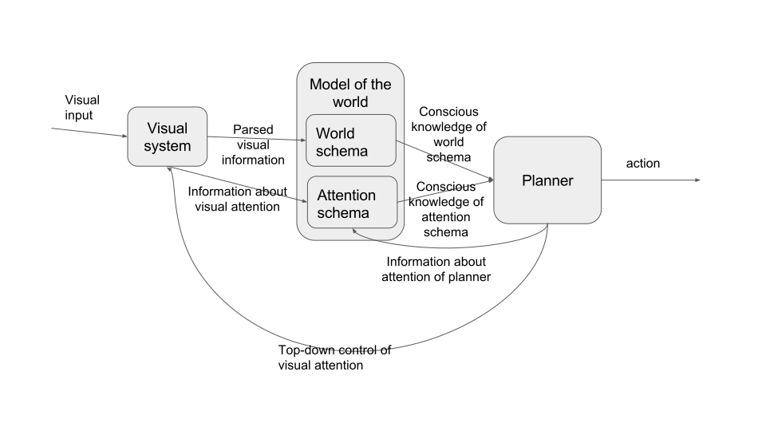

This code implements the core of a simple agent with an attention schema.

Here's a diagram of the architecture implemented in this agent:



And here's the code:

```python
def SimpleAttentionSchemaAgent:
  def __init__(self):
    self.visual_system = VisualSystem()
    self.model = Model()
    self.planner = Planner()

  def think(self, visual_input):
    """
    This method contains all the details of how information flows between
    different components of the agent. Details of how information is
    processed inside each component of the agent are specified in the
    classes for each component.
    """
    # Process world
    self.visual_system.process_visual_input(visual_input)

    # Update world schema with visual information from the visual system.
    self.model.world_schema.update_with_visual_info(self.visual_system.visual_info())

    # Update attention schema with the information about visual attention
    # that the visual system can provide
    self.model.attention_schema.update_with_visual_attention_info(
      self.visual_system.visual_attention_info())

    # Plan action. The planner uses the information available to it from
    # the visual system directly and from its world schema and attention schema.
    self.plan = self.planner.plan({
      "world_schema": self.model.world_schema.planner_info(),
      "attention_schema": self.model.attention_schema.planner_info()
    })

    # Update our model of what our planner was mostly thinking about
    self.model.attention_schema.update_with_planner_attention_info(
      self.planner.planner_attention_schema_info)

    # The planning system gets to control the attention of the visual
    # system (top-down attention)
    self.visual_system.control_attention(self.plan.new_visual_attention)

    return self.plan.action
```

As the comment says, details of how information is processed inside each component of the system are specified in the classes for each component. Obviously this is a cop-out and I haven't really implemented them.

This agent has a schema of both the outside world and its own mind, stored in its `model` field. Its world schema receives input from the visual system. Its attention schema receives some input from the visual system about visual attention, and also receives input from the planner about the attention of the planner. These schemas update themselves based on both new information and their current state. Both of these schemas can be approximations to the real world, with fidelity determined by the implementation.

The planner uses information from these schemas while making decisions. It does not have access to all the information in the schemas, just the information made available by the `planner_info` methods of the world schema and attention schema. So this agent can have information in its schema which is used by the schema when updating itself but which is not accessible to the planner.

---

Suppose we asked questions to an agent with this architecture. Because this agent only has visual inputs, we'd ask it questions by giving it to the agent in writing, and the agent would respond with an action corresponding to the answer it wanted. As with all actions performed by this agent, the answer to our question would be determined by the planner. Here are some features of the agent which we could observe, if it had sufficiently functional components:

- It could make unconscious inferences based on which features of its visual field it had been paying the most attention to. The detail with which it can do this depends on the extent of the information flow from the visual system to the attention schema through the `visual_system.visual_attention_schema_info()` method.
- It could answer questions about its visual attention, if the information in its visual attention schema was made available to its planner by the `attention_schema.planner_info()` method. The information in the attention schema might be stylized and potentially inaccurate.
- Because this agent's planner is a monolithic entity with access to all of the information in the schema, this kind of agent is generally able to answer questions about any of its beliefs that it is able to use to make decisions.
- If the attention schema is inaccurately updated, the agent may have attention without awareness or awareness without attention.

## What important details are elided by not giving full source code for this agent?

The components of the agent could be stupider than desired. For example, all of the components could just return random noise to each other. Because of this possibility, I'm not actually able to guarantee anything about the introspective ability of the agent. This ambiguity could be fixed by either implementing the components (possibly relying on outside code for complex parts of the logic), or just by specifying functional requirements that we're assuming they meet.

The components could also be much more powerful than I want. As I wrote it, it would obey my architecture if the VisualSystem component actually had a memory and planning component inside it. To some extent I could get around this problem by specifying invariants of the components. For example, I could require that the visual system has to output the same values of `visual_info()` and `visual_attention_info()` whenever it is given a particular input signal and attention control signal. This would force the visual system to be memoryless.

Finally and most importantly, many important details of consciousness only appear in the components. In particular, of the hypotheses which I want to implement:

- Drescher's "qualia as gensyms" hypothesis is about the model's response to a question about similarity of concepts
- Kammerer's theoretical introspection hypothesis is about the model
- Armstrong's headless woman illusion argument is about the inference algorithm and priors used in the model
- Sloman and Chrisley's ideas about the ineffibility of qualia are a claim about something about the representation used in the attention schema (or some other part of the self-model).

So it looks like I won't be able to skirt around the outside of the difficulty of implementing the whole thing if I want to be able to handle those hypotheses.

It seems like in the course of writing the whole program out, I'll end up being forced to make a lot of implementation decisions about the architecture of this mind. Some of those decisions will map directly onto the hypotheses about consciousness which I listed above. However, many of them will just be choices that I make. I'm excited about this, because it seems that as a natural consequence of writing the code in full detail I'll need to do the equivalent of generating many hypotheses about the implementation of human consciousness of a similar flavor as listed above.

At this stage it looks like I'll have to write the details of the model and the planner out in full. It's less clear how the visual system will need to work.
