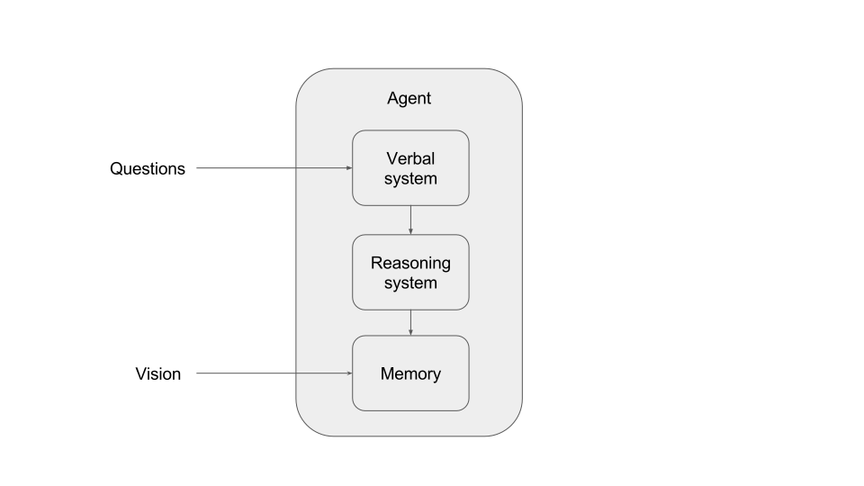

# A computer program to illustrate an illusionist theory of consciousness

## Introduction

I wrote a program which implements some aspects of two illusionist theories of consciousness. In this report, I'll explain how the program works and what it does.

## Background

In the course of writing his "Report on Consciousness and Moral Patienthood", Luke writes that he wishes theories of consciousness went further.

> In all these cases, my concern [about several existing theories of consciousness] is not so much that they are wrong (though they may be), but instead that they don’t “go far enough.”
>
> In fact, I think it’s plausible that several of these theories say something important about how various brain functions work, including brain functions that are critical to conscious experience (in humans, at least). Indeed, on my view, it is quite plausible the case that consciousness depends on integrated information and higher-order representations. And it would not surprise me if human consciousness also depends on prediction error minimization, recurrent processing, “multiple drafts,” and a global workspace. The problem is just that none of these ideas, or even all of these ideas combined, seem sufficient to explain, with a decent amount of precision, most of the key features of consciousness we know about.

Luke writes that he likes Graziano's attention schema theory (CITATION), but thinks that he would like more detailed theories more:

> Furthermore, I can think of ways to supplement Graziano’s theory with additional details that explain some additional consciousness explananda beyond what Graziano’s theory (as currently stated) can explain. For example, Graziano doesn’t say much about the ineffability of qualia, but I think a generalization of Gary Drescher’s “qualia as gensyms” account, plus the qualia-related suggestions of Sloman & Chrisley (2003), plus the usual points about how the fine-grained details of our percepts “overflow” the concepts we might use to describe those percepts, explain that explanandum pretty well, and could be added to Graziano’s account. Graziano also doesn’t explain why we have the conviction that qualia cannot be “just” brain processes and nothing more, but intuitively it seems to me that an inference algorithm inspired by Armstrong (1968) might explain that conviction pretty well.268 But why do we find it so hard to even make sense of the hypothesis of illusionism about consciousness, even though we don’t have trouble understanding how other kinds of illusions could be illusions? Perhaps an algorithm inspired by Kammerer (2016) could instantiate this feature of human consciousness.

He also lamented that it’s really hard to tell exactly what someone means by their theories of consciousness. For example:

> And yet, I don’t think this version of the Hero object is conscious, and I’d guess that Braithwaite would agree. But if this isn’t what Braithwaite means by "nociception," "mental representations," and so on, then what does she mean? What program would satisfy one or more of her indicators of consciousness?

Luke says that if he were a career consciousness theorist, he'd "write some “toy programs” that illustrate some of the key aspects of a Graziano / Drescher / Sloman / Armstrong / Kammerer (GDSAK) account to consciousness." That's what this is.

So I wrote a program which implements aspects of a few theories of consciousness, in the form of an agent which can answer questions about itself and its experiences. I implemented this agent in about 400 lines of Python, using the Z3 theorem prover to power the agent's reasoning.

## Aspects of a theory of consciousness implemented here

The two theories implemented are a variation of Drescher's "qualia as gensyms" theory, and Kammerer's theoretical introspection hypothesis (TIH). Qualia as gensyms is intended to explain the ineffibility of qualia, and TIH attempts to explain why it is that it seems meaningless to say that our conscious experience is illusory.

### Qualia as gensyms

In "Good and Real" chapter 2, Drescher tries to explain the ineffibility of qualia by drawing an analogy to gensyms, which are a feature of some programming languages. In Good and Real, he writes (page 81-82):

> In the computer language Lisp, a gensym (short for generated symbol) is an object that has no parts or properties, as far as Lisp programs can discern, except for its unique identity—that is, a Lisp program can tell whether or not two variables both have the same gensym as their value (as opposed to two different gensyms, or else other kinds of objects, such as numbers or strings). Arbitrarily complicated structures can refer to gensyms, placing the gensyms in relation to one another (and to other objects). But each gensym is uniquely identifiable even apart from its occurrences in any such structures.
>
> Similarly, I propose, our basic sensations, such as seeing red, may be represented by distinct gensyms (or at least, by gensyms suitably augmented—-to support, for instance, comparisons of brightness or hue, in the case of color-gensyms, in addition to pure discrimination of identity). A Lisp program cannot examine whatever internal ID tag distinguishes a given gensym from any other; yet the program can tell whether or not something is indeed the same as that gensym. Similarly, we have no introspective access to whatever internal properties make the red gensym recognizably distinct from the green; our Cartesian Camcorders are not wired up to monitor or record those details. Thus, we cannot tell what makes the red sensation redlike, even though we know the sensation when we experience it. (Gensyms metaphorically capture an aspect of qualia emphasized by many authors—e.g., in recent work, the transparency spoken of by Metzinger [2003]; and the homogeneity and nondecomposability discussed by Clark [2005].)

The relevant feature here is that we have a sense that qualia are different, and like something, but we don't have any introspective access to what they're like, really. Drescher's claim is that if an agent doesn't have introspective access to the representation of an experience but *does* intuitively know whether the experience is the same as a different experience, the agent will think that the state has an undescribable, ineffable quality to it. This can be implemented by giving an agent access only to facts about which of its experiences are the same as which of its other experiences, and not allowing it to access details of the representations of these experiences. To allow for partial effibility of color qualia, instead of just being allowed to know which experiences are the same as other experiences, agents are allowed to compare colors and get back a number representing the distance between them.

Most humans intuitively feel that inverted spectra are possible, and also that it makes sense to compare the qualia of different people. Here are three ways that our intuitions could be different on this topic:

- We could feel that it's logically necessary that everyone experiences green the same way. I think that human intuitions about pain are close to this--I think that most people find inverted spectra more plausible than inverted pain scale.
- We could feel that the question was meaningless--maybe we feel that qualia are facts about how a particular person's mind represents something, and it's meaningless to ask about whether two humans have the same representation of a concept in the same way that you can't evaluate equality of items from different types in type theory. TODO: explain this better.
- We could feel that it was logically necessary that everyone experiences green a different way. TODO: expand on this, maybe.

But instead, we feel like inverted spectra are both meaningful and concievable. As a result of using Drescher's model of ineffibility, my agent gives the same answers as humans do.

TODO: Maybe I should explicitly list the set of questions which the agent answers the same as humans do about this.

### Kammerer

Kammerer's paper "The Hardest Aspect of the Illusion Problem — and How to Solve it" notes that the claim that consciousness is an illusion seems much more implausible than the claim that various other things are illusions. He writes:

> [...] the illusion of phenomenality is not only *very powerful*; it is, in fact, *much more* powerful than *any other illusion*. It is powerful in a very distinctive way, as we face a unique intuitive resistance when we try to accept the illusory nature of phenomenality.
>
> [...]
>
> Many proponents of illusionism, I think, would begin by saying that illusionist theories can already explain this intuitive resistance to illusionism in a rather natural way. They would draw a parallel with perceptual illusions. The illusion of phenomenality may arise because of some hardwired features of our introspective device, in such a way that this illusion has some degree of cognitive impenetrability (Frankish, this issue, p. 18). It persists even in the face of opposite beliefs. That could explain why, even if we are convinced illusionists, our intuition still pulls us away from illusionism. Similarly, in the Müller-Lyer illusion, we are still intuitively tempted to judge that the two lines have different lengths, even when we believe that they do not.
>
> The problem, from my point of view, is that we cannot explain the hardest aspect of the illusion problem simply by following this model. Indeed, when facing a Gregundrum, we do not have any particular intuitive resistance to entertaining the hypothesis that the apparent presence of a solid Penrose triangle could merely be an illusion. On the contrary, this hypothesis seems perfectly intelligible and sensible — actually, this may be the most natural hypothesis that comes to mind when facing what seems to be an impossible object, such as a Penrose triangle. So, this model cannot explain the peculiarity of the illusion of phenomenality.

His "Theoretical Introspection Hypothesis" attempts to explain this. The TIH is a claim about our naive epistemology:

> The TIH states that the content of these theories includes, so to speak, the following statements:
>
> 1. Minds can take up information about states of affairs, and then can use that information to form beliefs about them: states of affairs appear to minds.
> 2. The way minds do that is that they are affected in a certain way, they have certain experiences.
> 3. The properties of experiences determine what appears to the mind, and a state of affairs appears to the mind in virtue of these properties of experiences. For example: an experience of a red circle is an affection of the mind in virtue of which the presence of a red circle appears to the mind.
> 4. Take all the cases in which a certain state of affairs A appears veridically to a subject S, and consider what all these cases have in common regarding the way in which S is affected. What they have in common is a state E, which is an experience of A. Something is a part of E if and only if this thing is part of the way in which S is affected in all the cases in which A appears veridically to a subject.
> 5. Appearances can be fallacious, and a mind can be deceived by the way states of affairs appear. And here is what happens in cases of fallacious appearances: when a subject S has a fallacious appearance of A, S is affected in exactly the same way as in cases of veridical appearances of A, except that A is not the case. That is to say, when a subject S has a fallacious appearance of A, it is in state E (E being, and being nothing but, what is common to the way S is affected in all the cases in which A appears veridically to her), but A is not the case.


## Example run of the program

Here's what you get if you run `ExampleRun.py`.

```
Q: Suppose there are two humans Bob and Jane, do they have the same qualia associated with every color?
Both that statement and its negation are possible.

Q: For all y, does there exist an x such that x = y + 1?
Yes.

Q: For all two humans, do they see colors the same?
Both that statement and its negation are possible.

Q: Are your memories at timestep 0 and 1 of the same color?
Yes.

Q: Are you seeing the same color now as you saw at timestep 0?
No.

Q: Is it possible for an agent to have an illusion of red?
Yes.

Q: Is it possible for you to have the illusion that Buck is experiencing a color?
Yes.

Q: Is it possible for Buck to have an illusion that he is having the experience of redness?
No, that's impossible.
```

## How it works

The program is written in Python 2. It uses the theorem prover Z3.

It has the following classes:

- Agent
- AgentVerbalSystem
- AgentReasoningSystem



When it sees a hue, here's what happens: We call the `show_hue` method of Agent. This sets the agent's `current_hue` field to the hue. It also adds this hue to the end of the Agent's list of memories.

When you ask it a question, here's what happens:

- We call the `respond_to_question` method on Agent
- This calls the `respond_to_question` method of the AgentVerbalSystem
- This interprets the question in terms of concepts the agent knows.
- The verbal system then often calls the `check_statement` method of the AgentReasoningSystem, which does logical inference based on inputs to the reasoning system from other modules--in particular, from the Agent's `memory` and `current_hue` fields.

With this program, we intend to provide a model for the functional behavior and relationships between several components of a mind. One way in which the program written here is obviously an unrealistic model of human consciousness is that human brains don't actually make judgements by using a first-order logic theorem prover. This is of course true. In this project, we're not trying to talk about the internal functioning of individual components in our brain. This program isn't intended to illustrate a hypothesis like "human intuitions about consciousness are actually implemented with a first-order logic theorem prover with these axioms". It's trying to add precision and clarity to claims like "If an agent knew that its verbal system did not have access to its internal representation of color, but it did have access to some representation of the difference between different colors, then it would get the impression that it's meaningful to ask about whether other agents have inverted spectra, and that they plausibly do."

### Consciousness explananda

#### Ineffibility and inverted spectra via modification of Drescher's "qualia as gensyms" theory

In Drescher's original formulation of this theory, qualia were gensyms--that is, objects which have distinct identities but no other properties, such that the only operation you can do with them is compare them and see if they are the same gensym or not. He proposes that this is why qualia seem ineffable: your verbal system isn't able to access any property of their internal representation; it only knows which quale is which.

In this program, I've implemented a more general version of this idea which handles the partial ineffibility of hues. When we experience hues, we are unable to explain what it's like to see them, but we are able to feel the extent to which they differ. The agent here has the belief that there is a number representing the experience of each color. It believes that it is meaningful to compare the numbers representing its experience to the numbers representing the experience of another agent. But it doesn't believe that the number of this experience is logically determined by the color that it's seeing.

More concretely: Vision is a function from (Human, Hue) to HueQuale. This implementation suggests that qualia are objective features of the world, so it's meaningful to compare the qualia of two humans, but that the relationship between an objective feature of the world and the subjective experience of it is agent-dependent. In this system, both Hue and HueQuale are represented as integers from 0 to 31, where addition is defined to "wrap around", so that eg 25 + 20 = 13 (because 13 + 32 = 45). This wrapping around behavior allows us to express the idea that we intuitively experience hue as a wheel rather than a spectrum.

Agents do not have access to the number which is representing their HueQualia. Instead, when they try to make judgements about their memories or their current experience, the AgentReasoningSystem calls the `sense_axioms` method of the main Agent object to get information on its current seen hue and its memories. This method returns something like

    memory(myself, 0) - current_quale(myself) == 10
    memory(myself, 1) - current_quale(myself) == 10
    memory(myself, 2) - current_quale(myself) == 0
    memory(myself, 3) - current_quale(myself) == 0
    memory(myself, 0) - memory(myself, 1) == 0
    memory(myself, 0) - memory(myself, 2) == 10
    memory(myself, 0) - memory(myself, 3) == 10
    memory(myself, 1) - memory(myself, 2) == 10
    memory(myself, 1) - memory(myself, 3) == 10
    memory(myself, 2) - memory(myself, 3) == 0

So the agent never has access to the actual values of its experience, but it feels like there is an actual value associated with all of its experiences.

TODO: I'm not sure about this--it kind of seems like this is a model of an agent which has the impression that there is nothing it is like to see red, but that it knows facts about how its red experience compares to its experience of other colors.

#### Kammerer's Theoretical Introspection Hypothesis

This translates fairly directly into a set of first-order logic claims which are included in the AgentReasoningSystem in this implemetation, in the `theoretical_introspection_hypothesis_axioms` function.

My translation looks like this:

- Every state that the world could be in is described by a WorldState. In this theory, the world has a hue and some number of agents in it who are experiencing hues.
- WorldStates consist of many WorldFacts. WorldFacts correspond to Kammerer's concept of a "state of affairs".
- WorldFacts are either facts about what hue the world is (WorldColorFacts) or what hue an Agent is experiencing (ExperienceFacts).
- WorldFacts are "consistent" iff it is concievable that both are true in the same world state. A more specific definition is: WorldFacts are consistent unless they're both WorldColorFacts and they disagree on what color the world is, or if they're both ExperienceFacts about the same agent and they disagree with color the agent is experiencing. This definition of consistent facts looks like this in the code:
- Agents might have an experience of a particular WorldFact. This is what Kammerer describes as the state which is "part of the way in which [the subject] S is affected in all the cases in which [the state of affairs] A appears veridically to a subject".
    - Agents don't have an experience associated with every world fact. For example, the agent X has no experience of the fact "agent Y is experiencing red".
    - So in fact, an agent A has an experience of a WorldFact WF if:
        - WF is a WorldColorFact, in which case the experience is the experience of A seeing that color, or
        - WF is the ExperienceFact which describes A having an experience E, in which case the experience of this fact is E.
    - This is described in the code by having a function `experience_of` from an Agent and WorldFact to either a Quale or nothing.
- In the world state WS, agent A has an illusion of a WorldFact WF if both of the following are true:
    - The fact WF is not actually present in WS. (Gettier-style situations aside, you're not having an illusion of something if it's really there.)
    -  If experience_of(A, WF) is a quale Q, then WS contains the ExperienceFact corresponding to A experiencing Q.
        - This means that for Jeff to be having an illusion of the world being red, Jeff must be experiencing red.

The result of this is that the agent thinks that it's concievable that one might have an illusion of the world being a particular color, and it's concievable that one might have an illusion of *someone else* seeing a particular color, but it's not logically possible to have an illusion of your own conscious experience.

## Limitations to this approach

There are a bunch of things that it would be nice if my agent could reason about, but which I think are very hard or impossible to express with Z3, the theorem prover I’m using, and I don’t know if they’re possible with any currently available theorem prover.

### Communication

It's hard to express ideas about the limitations of communication between agents. For example, "No matter what question I ask you, we’ll never be able to know if we’re having the same experience of red", which is a reasonably good description of ineffability, is *really hard* to express and prove.

Here’s what’s hard about it:

- Talking about what other agents know. This is hard because classical logic doesn’t let you express things like "this agent doesn’t know X, but he does know that X -> Y". To express this kind of thing, I’d need to use a modal logic theorem prover. I think that such theorem provers exist, but I don’t know how good they are.
- Talking about the communication of other agents. This one is hard because it requires a formalized definition of "communication" which is powerful enough to express everything we want the agent to understand, but which the theorem prover understands well enough to prove things about. I don’t know if there exist theorem provers which can prove properties of communications between agents. (I think it’s 10% likely that it would be easy to build facts about communication on top of modal logic if I knew modal logic better.)

Instead of expressing it properly, I’ve been expressing things like "Humans don’t necessarily have the same experience when they’re looking at the same color." This expresses part of the idea, but doesn’t imply ineffibility.

### Intuitions/fuzzy logic/probabilistic reasoning

Using first order logic, it's not very easy to express the fuzziness of beliefs. A lot of our intuitions about consciousness feel fuzzy and unclear.

In FOL, we're not able to express the idea that some beliefs are more intuitive than others. We're not able to say that you believe one thing by default, but could be convinced to believe another. For example, I think that the typical human experience of the inverted spectrum thought experiment is that you've never thought about inverted spectrum before and you'd casually assumed that everyone else sees colors the same way as you do, but then someone explains the thought experiment to you and you realize that actually your beliefs *are* consistent with it. This kind of belief-by-default which is defeatable by explicit argument is not compatible with first order logic.

Logicians have developed a host of logical systems that try to add the ability to express concepts that humans find intuitively meaningful and that FOL isn't able to represent. I'm personally quite skeptical of using the resulting logical systems as a tool to get closer to human decision-making abilities, because I think that human logical reasoning is actually a super complicated set of potentially flawed heuristics on top of something like probabilistic reasoning, and so I don't think that trying to extend FOL itself is likely to yield anything that mirrors human reasoning in a particular deep or trustworthy way. However, it's plausible that some of these logics might be useful tools for doing the kind of shallow modelling that I'm doing in this project. Here are some plausibly relevant ones:

- [Default logic](https://en.wikipedia.org/wiki/Default_logic) extends FOL to be able to handle statements like "birds usually fly"--it will assume by default that a given bird can fly until it has evidence to the contrary.
- [Fuzzy logic](https://en.wikipedia.org/wiki/Fuzzy_logic) allows truth values to be real numbers between 0 and 1, to allow for predicates like "tall" which can be more or less true.
- Someone has built [fuzzy default logic](http://www.emeraldinsight.com/doi/abs/10.1108/17563781111115769), so combining those is possible.

It might actually be end up being easier to write a new own theorem prover than to use an off-the-shelf one for this problem. The theorem prover community is mostly interested in being able to solve problems where the difficulty is that you have an extremely large number of variables which are connected to each other in relatively simple ways. (SAT solvers are an extreme example of this.) For this project, we have relatively few variables and relatively complicated logical relationships between them, and we don't mind using algorithms that aren't guaranteed to terminate or return the right answer in hard cases. So a specialized theorem prover (perhaps based on a graph search over the space of possible proofs) might work better.

### Unable to implement one-off reasoning

In first order logic, I can't directly express claims about the deductive processes that an agent uses.

For example, Armstrong (1968) discusses the illusion of a headless woman:

> To produce this illusion, a woman is placed on a suitably illuminated stage with a dark background and a black cloth is placed over her head. It looks to the spectators as if she has no head. The spectators cannot see the woman's head. But they gain the impression that they can see that the woman has not got a head. (Cf. 'I looked inside, and saw that he was not there.') Unsophisticated spectators might conclude that the woman did not in fact have a head.
>
> What the example shows is that, in certain cases, it is very natural for human beings to pass from something that is true: 'I do not perceive that X is Y', to something that may be false: 'I perceive that X is not Y'. We have here one of those unselfconscious and immediate movements of the mind of which Hume spoke, and which he thought to be so important in our mental life.

This is a claim about a deductive process that humans have--that in certain conditions, we go from "I don't percieve that X is Y" to "I percieve that X is not Y". To express this, we might need to use a logic that had features of default logic or modal logic.

Another example is Gary Drescher's other consciousness theories in "Good and Real". A lot of his ideas come from specific claims about how our mental algorithms work, and so they can't be expressed easily in FOL. TODO: WRITE MORE HERE AFTER GETTING THE BOOK

### Repetitiveness of the current strategy

As it is, I'm implementing behaviors twice:

- I have to make the agent behave a particular way, by writing code in Python in a variety of places in the agent.
- I have to make the agent believe that agents behave a particular way, by writing logic in Z3 in the AgentReasoningSystem which describes that behavior.

To go even further, I'd have to make the agent believe that agents believe that agents behave a particular way. This recursion could bottom out if I could introduce an axiom that was something like "For all beliefs B, if you believe B, you believe that you believe B". But this kind of axiom both isn't expressible without modal logic, and also isn't clearly true--humans have the capacity to be inconsistent about this kind of thing, and it seems plausible that this capacity for inconsistency might end up being relevant to our intuitions about consciousness.

I think that human intuitions about consciousness arise from a combination of innate predispositions to particular theories and learning from introspection and talking to other people. This is closer to the Agent being created with very little content in its AgentReasoningSystem (and so very little introspective ability), and learning from observing its own behavior over time and putting the things it learned in its AgentReasoningSystem.

I guess my real belief here is that we're born with predispositions to represent particular concepts in particular ways--we have "hardware accelleration" for thinking about the beliefs and desires of other humans so that we can succeed in social games--but these predispositions are more like foundations which we use learning to build on.

## Where to go from here

TODO
